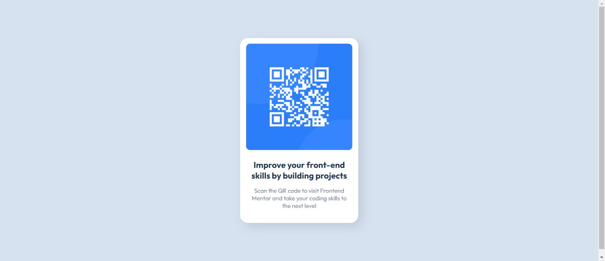

# Frontend Mentor - QR code component solution

This is a solution to the [QR code component challenge on Frontend Mentor](https://www.frontendmentor.io/challenges/qr-code-component-iux_sIO_H). Frontend Mentor challenges help you improve your coding skills by building realistic projects. 

## Table of contents

- [Overview](#overview)
  - [Screenshot](#screenshot)
  - [Links](#links)
- [My process](#my-process)
  - [Built with](#built-with)
  - [What I learned](#what-i-learned)
  - [Continued development](#continued-development)
  - [Useful resources](#useful-resources)
- [Author](#author)

## Overview

 This is my first challenge. Built the QR code screen, with mobile version as priority. Did not have design files, pixels are guesstimated. 

### Screenshot

### Links

- Solution URL: [https://github.com/Lulybunny/QRcodecomponent]
- Live Site URL: [https://lulybunny.github.io/QRcodecomponent/]

## My process

I wanted to keep the code as simple as possible with my current knowledge. At first, I had too few divs and wasn't getting the box.  Once I had the box, image, and text, I spent the most time just figuring out the details. Used flexbox to center the box both horizontally and vertically. Tried my best to have it look identifcal to original. Such as adding padding to text, so that the words wrapped exactly the same. I feel as if the header font might be slightly smaller than the original but as close as I can figure out while keeping paragraph font to specified size. I added a shadow to the 

### Built with

- Semantic HTML5 markup
- CSS custom properties
- Flexbox
- Mobile-first workflow

### What I learned
Need a div for the background to create another object over it.  Media queries syntax order. How to add a shadow to a box.

### Continued development

How to do more with flexbox. A decided to comment out the media query since it's not required at this level and without design files I'm really not sure what the size of the box should be in desktop version. 

### Useful resources

- [W3Schools](https://www.w3schools.com/) - I used this site to look up syntax for media queries, which I have only started learning. And how to add a shadow for the box as I had never done that before in any tutorial.
- [Color-Hex](https://www.color-hex.com/) - Used this site to find the next closest gray to the background for the shadow.

## Author

- Frontend Mentor - [@lulybunny](https://www.frontendmentor.io/profile/lulybunny)
